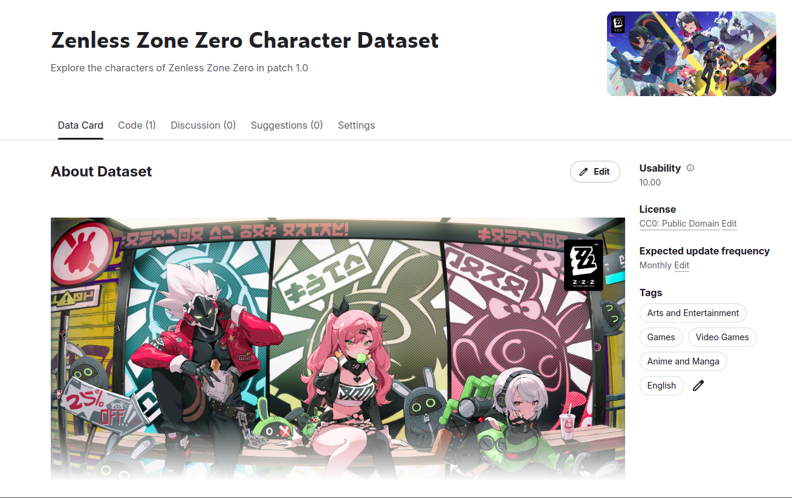
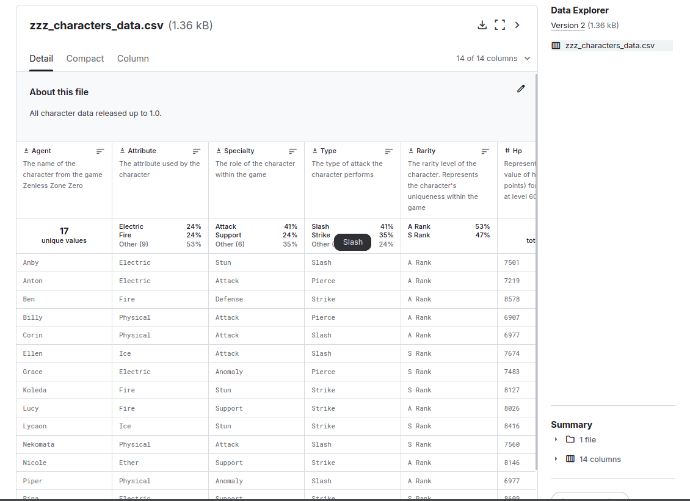

# ZZZ_Web_Scraping

Esse repositório tem como intuito salvar o script usado no Web Scraping dos personagens do jogo Zenless Zone Zero, o foco é realizar atualizações mensais acompanhando o lançamento de novos personagens do jogo. Esse projeto tem o foco de ser algo voltado apenas para o aprendizado. O CSV está disponível também no Kaggle, onde apresenta mais informações sobre o dataset gerado.

## [Kaggle](https://www.kaggle.com/datasets/masterchiefpv/zenless-zone-zero-character-dataset/data)

